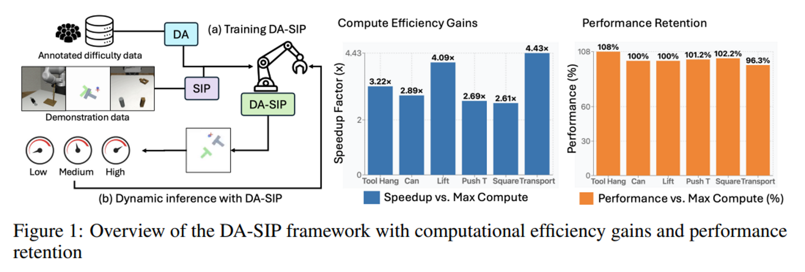
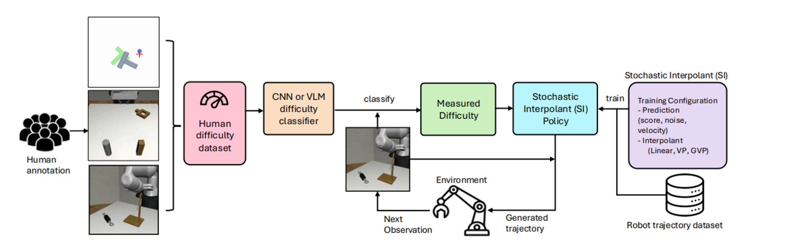

# DA-SIP
https://openreview.net/pdf/7a30c2c968c8780bf3b856c68fafd01463d929dd.pdf

## 解决了什么问题：
基于扩散和流的生成式机器人控制器如DP在长时序机器人操控和模仿学习任务重表现出色，但在每个控制步骤都采用固定的、最大的推理计算预算，导致在处理见到子任务时效率低下，复杂子任务时性能不佳

## 论文提出：
引入 难度感知随机插值策略（DA-SIP）框架，使机器人控制器能够根据任务难度实时、自适应地调整它们的积分步长、求解器类型和积分模式（ODE/SDE），从而在保持任务成功率的同时显著提高计算效率。
通过训练一个难度分类器Difficulty Classifier来识别当前观测的难度，可以动态地分配计算预算：简单任务使用少量的System 1计算，困难任务使用大量的System 2计算。

在训练过程中选择1预测目标2插值器 生成一个能同时执行ODE和SDE积分的生成策略网络 在推理阶段朗读分类器会自适应的选择推理配置三元组（步数 求解器类型 ODE/SDE）

## 如何解决：
DA-SIP 框架主要包含三个关键组件和步骤：
1. 基于 SI 的策略网络训练：
使用随机插值SI损失来训练一个单一的生成策略网络，训练好的网络可以同时用于确定性的 ODE 积分（快速、精度较低）和随机的 SDE 积分（慢速、鲁棒性较高），并支持不同的积分步长 N 和求解器。
2. 难度分类器训练与选择：
数据标注： 首先，收集机器人轨迹数据集，并由人类标注员根据任务的子目标或状态，将每个时间步的 RGB-D 观测标注为不同的难度等级（1-粗略移动，2-接近，3-精确放置）。
分类器训练： 训练一个难度分类器来预测当前观测 o_t 的难度等级 d(o_t)。
例如：
* 轻量级 CNN： 效率最高，用于实时分类。
* Few-Shot VLM： 无需训练，但延迟高。
* 微调 VLM： 精度最高，延迟可接受。
3. 自适应计算分配：
 映射函数 M： 在每个控制周期，难度分类器输出难度等级 $d(o_t) \in \{1, 2, 3\}$。一个经验确定的映射函数 M 将此难度等级转化为一个最优的推理配置三元组
 动态执行： 策略网络使用此动态选择的配置来生成下一动作，从而将计算资源分配给真正需要的步骤。

