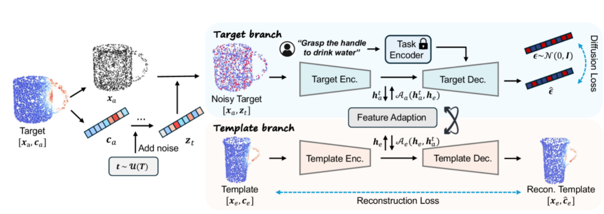
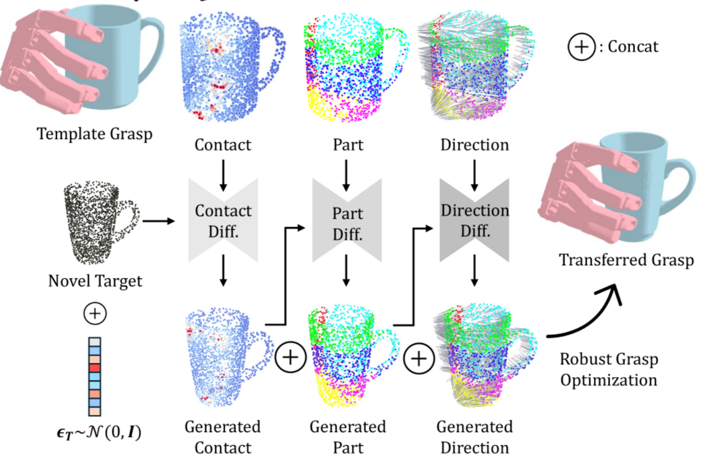

# CMT-diffusion
https://arxiv.org/html/2511.01276v1

## 解决了什么问题：
现有灵巧抓取解析方法虽然能确保稳定性但是效率低下且缺乏任务适应性，生成方法由于数据限制对没见过的物体和任务泛化能力较差

## 本文提出：
一种迁移框架，能够将高质量的抓取知识从形状模版迁移到同一类别中的新颖物体上，以提高抓取生成的泛化能力。
通过将抓取问题重新表述为物体接触图的生成问题，并使用条件扩散实现迁移。
（基本思想：抓取的关键在于物体表面的接触信息，模型通过学习将物体形状相似性和任务规范整合到扩散过程中，从已知模版的抓取接触图迁移到新颖物体的接触图，从而生成稳定且可泛化的抓取）

## 独特性：
抓取表示：专注于接触 而非直接在手部参数空间或点云空间进行生成
泛化机制：模块-新物体的迁移框架，利用物体形状相似性进行知识转移而非依赖大量数据的覆盖范围
接触细节编码：双重映射机制和额外的物体中心图来编码

## 如何解决：
1. 接触图生成重构：将高维度的抓取配置问题简化为生成物体表面上表示接触信息的二维、三维图
2. 双重映射机制：利用以对象为中心的部件图和方向图来丰富接触表示，并开发了cascaded conditional diffusion model以联合迁移三种图，以确保它们在生成过程中的内部一致性
3. 鲁棒的抓取恢复机制：在生成接触图后，引入一个后处理步骤，用于识别具有可靠部件和方向预测的接触点，高效优化抓取配置

条件扩散模型：通过模版-目标学习迁移接触图，模版分支对形状模版进行编码，目标分值对潜在向量进行去噪，双向适应模块通过特征桥接分支

级联扩散框架
