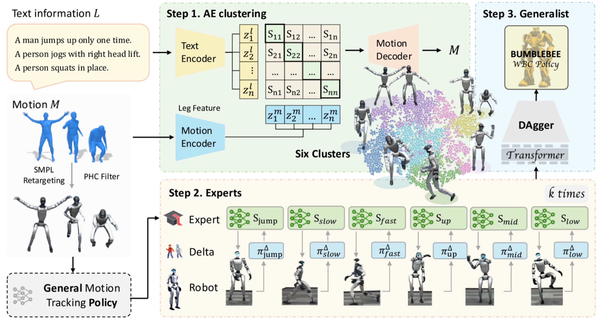

# BumbleBB
https://ar5iv.labs.arxiv.org/html/2506.12779

## 解决了什么：
人形机器人实现通用、敏捷的全身控制是一个重大挑战，难以泛化到高度多样化的行为，现有框架难以将单一运动策略推广到高差异行为，往往会因为数据分布不匹配和梯度冲突导致性能下降。

## 论文提出：
BB专家-通用学习框架，通过根据运动特征和描述对行为相似的运动进行聚类，在聚类中训练专家策略并通过迭代增量动作建模进行simtoreal适应，训练出通用的全身控制策略。

## 如何解决：
主要解决对象：数据分布不匹配
1. 数据结构化：
   * 运动重定向和过滤：将来自AMASS数据集的人类运动重定向到机器人模型，并使用PHC过滤出高质量的机器人可行的轨迹
   * AE聚类：使用transformer结构的自编码器同时编码运动特征和对应的文本表述；使运动潜空间对齐，确保具有相似语义和动力学特征的运动在潜空间中靠近
2. 专家策略训练
采用三层MLP实现，并通过RL进行训练
首先训练一个通用的运动跟踪策略，并基于基础策略为每个运动集群微调出专家跟踪策略，使得专家能专注于特定的运动类型。
针对每个集群单独进行delta action训练，模拟sim和real间差异
3. 知识蒸馏
采用Dagger实现专家知识蒸馏，transformer作为通用策略模型的骨干模仿专家策略的输出

左：数据整理阶段，包括运动重定向和基于PHC的过滤。中间上方展示聚类过程，根据语义和运动学进行分组。下方：针对每个聚类的专家策略的迭代增量微调。最后被提炼成一个通用Whole-body control策略

## 独特性:
专家-通用的范示
引入基于自编码器的运动聚类
为每个聚类训练专门的delta action model来补偿simtoreal误差而不是单一的delta action model或者领域随机化

## 数据：
人类运动：AMASS
文本数据：HumanML3D
机器人硬件验证
