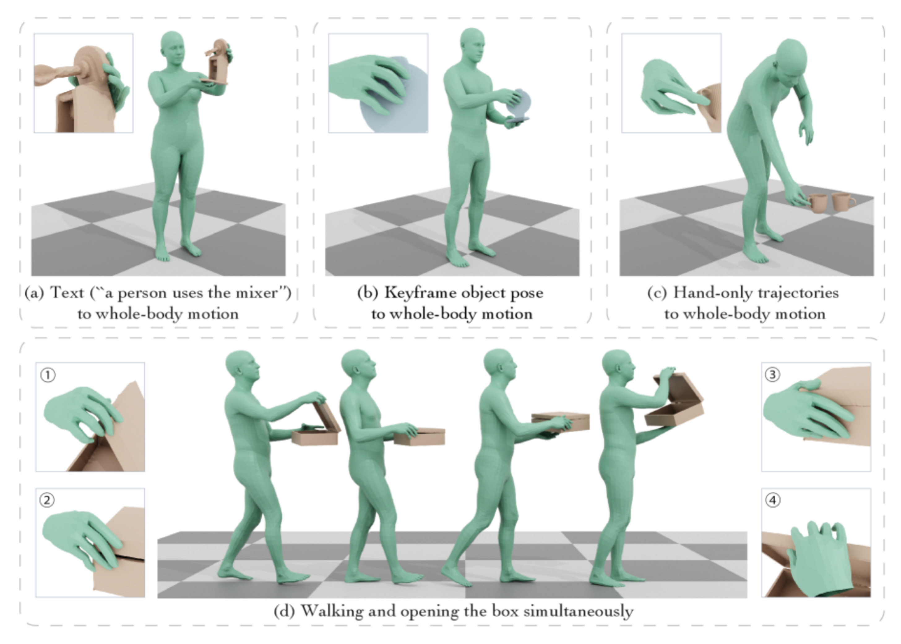
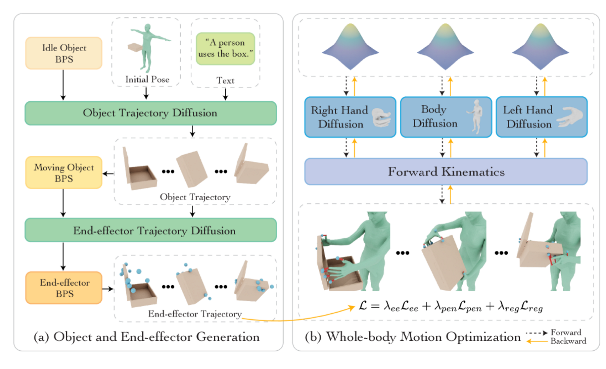

# coda
https://ar5iv.labs.arxiv.org/html/2505.21437

## 解决了什么问题：
合成包括身体运动、手部运动、物体运动在内的全身关节物体操作极具挑战性，1全身紧密协调2高自由度高精度

## 论文提出了：
提出用于关节物体全身操作的协调扩散噪声优化的CODA框架，能够联合合成人体、手部、关节物体的运动，给定人体和物体初始姿态、文本指令，合成涉及人体、手部和关节物体协调运动交互序列。
优化三个专用扩散模型的输入噪声向量（人体、左手、右手），并用基点集（BFS）的统一表示把末端执行器和物体几何对齐，从而实现高精度的全身操纵含铰链、关节的工具或物体

## 怎么解决：
1. BPS:
使用 BPS将对象表面和末端执行器都编码为同一 “距基点集的距离向量” 表示，从而把手—物体的相对空间关系、接触区域等以统一向量化形式表达，便于用作优化，帮助实现高精度的手—物体对齐（尤其对铰接部位.）
2. 分模型+噪声空间联合优化
全身运动生成：分别训练人体、左手、右手的扩散生成模型，但在生成阶段不单独采样而是在这些模型的噪声输入空间同时优化，通过梯度传播沿人体运动学链条使三者协调

Pipeline:给定初始的人体姿态、物体姿态和文本，首先通过两个条件扩散模型1生成关节物体轨迹和2相应的末端执行器轨迹；然后，通过运动链传播梯度，在末端执行器跟踪、穿透和正则化的指导下，3优化三个解耦扩散模型的潜在噪声输入；最后，将优化后的噪声通过扩散模型进行处理，以合成与生成的物体运动一致的连贯全身运动

## 论文用的数据：
ARCTIC用于锻炼铰链对象交互
GRAB用于刚体交互基线对比
利用大型人体集合（如 AMASS）用于 body 模型训练，以及 hand-only 数据集用于 hand 模型或用来作为优化目标，
将其扩展为一个三阶段模型：首先生成物体运动，然后预测指尖和手腕轨迹，最后生成全身运动