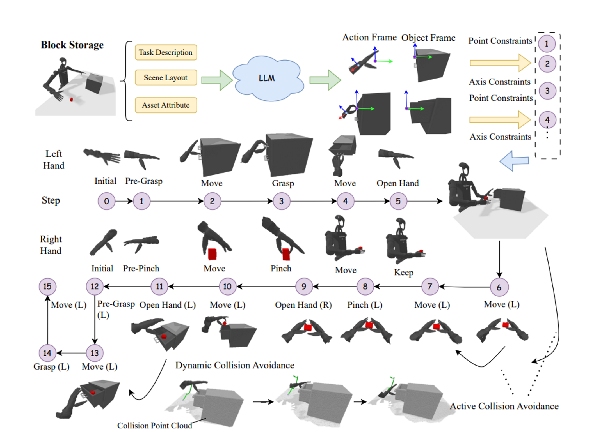

# Humanoidgen
https://arxiv.org/pdf/2507.00833

## 解决了什么问题：
现有dataset和benchmark主要针对robot arm，而humanoid robot缺乏高质量的演示数据，因此要解决如何自动化生成多样、可执行、带语义空间的仿真场景与演示，尤其是长时间和多阶段的双臂任务，以便训练并扩展到真实世界。

## 论文提出：
一个自动的仿真任务创建+演示收集框架，用原子化手部操作+LLM推理+为长程任务基于MCTS（蒙特卡洛树搜索的变体）的增强来自动生成场景、规划可执行的空间约束链并收集双臂演示，为humanoid提供大规模多样的可操作策略数据。

## 怎么解决：
Pipeline:

1. LLM：通过空间标注使LLM理解场景和任务的空间和关系，并根据物体的affordance和场景描述生成如下图可执行的空间约束链，自动化语义任务描述到具体可执行约束的过程
   * 输入：任务指令、可用操作、场景语义/affordance信息（包括哪个物体可以被抓、哪些表面可以防止、哪些动作允许等）
   * 输出：任务分解、可执行的空间约束链提供给运动规划器可执行结构
   
2. LLM在长序列任务容易犯错，所以结合MCTS增强长程推理：
MCTS通过树搜索探索更多可能的子任务序列并选择执行成功率最高的路径
树节点表示：当前状态（物体位置、双臂姿态、已完成操作）、可执行操作、当前步骤完成度

## 独特性：
1. 与传统利用LLM生成高级任务计划并且需要大量预定义低级操作不一样，本文包含了任务分解、关系动作约束和碰撞机制（物理约束链）
2. 引入MCTS校正，增强长序列推理
3. 驱动humanoid而不是单一动作

## 用到的数据：
数据以“约束链/原子动作”为单位生成
自动生成的演示集合：用 HumanoidGen 在仿真中生成了 20 个多样的桌面操作任务，并对场景做了随机化与扩充提高多样性

## 扩展：
把LLM与可执行运动规划形成闭环，形成生成-执行-评估-修正的动作链，可以规模化生成覆盖日常生活各种操作的预训练集催生通用操作基础模型