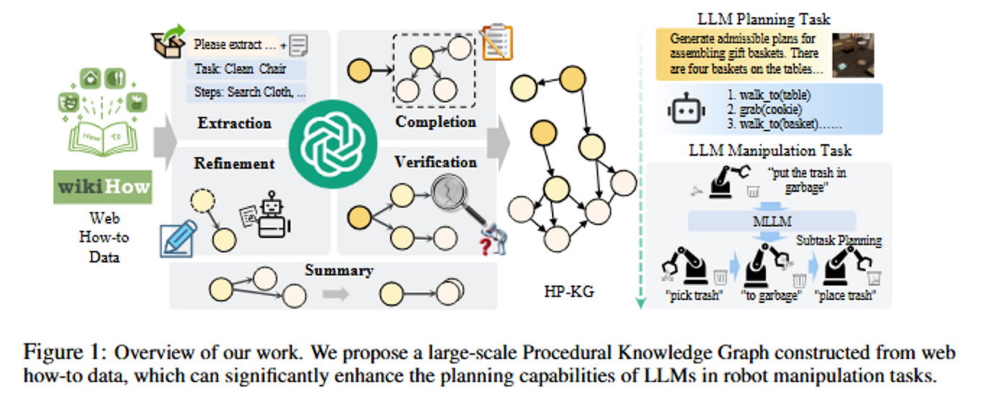
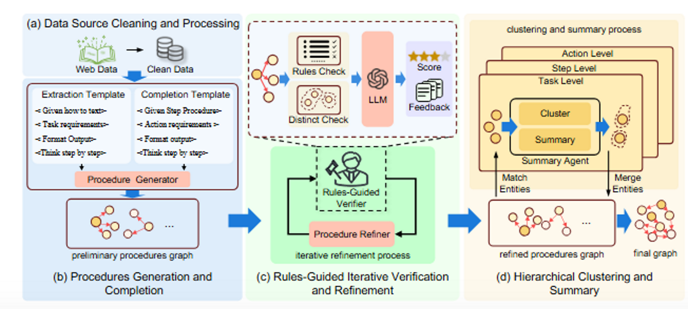

# HP-KG
https://openreview.net/forum?id=8LO0vLRXpz

## 解决了什么问题：
LLM 在解决长时序、多步骤、约束多的复杂操作上不足，导致生成的操作步骤不准确或不可执行。
部署大规模 LLM 能耗高、效率低，现实应用受限。

## 论文提出了什么：
提出构建有效的程序知识图谱来增强LLM的规划器，为了有效的表示程序性知识：提出了HP-KG，分层程序性知识图谱，将程序组织成三个不同的层：任务、步骤、动作，用 LLM 多智能体自动构建，把它作为外部符号知识注入到小模型中，从而在复杂机器人操控的长流程规划上显著提升低规模 LLM 的能力、并减少对超大模型的依赖

提出使用HP-KG的方法：给定一条语言指令，生成一个精细化的查询，以基于语义相似性检索相关的知识节点。通过 K 广度优先搜索和重排序，该方法识别出最相关的节点，并将其子图转换为文本描述，用于上下文规划

## 为什么能解决：
1. 程序知识图谱的层级结构设计：
任务 → 步骤 → 原子动作，分别对应复杂的复合程序、简单的复合程序和原子程序，大型 LLM 内隐地存储程序性知识，但检索受限；HP-KG 把这些知识变成显性、结构化的记忆，便于小模型直接查阅与条件化生成，降低模型内部记忆与推理负担。
2. 自动化构建
提出基于LLM的多智能体框架用于自动构建过程知识图谱，避免人工标注
自动构建流程pipeline

3. 注入小模型
在推理阶段，HP-KG 为小 LLM（7B）提供检索式提示或约束，使其在复杂规划时获得“程序化先
验”，从而在效果上可胜过无 KG 的 72B LLM。

独特性：
独特性：
把程序性 知识用层级知识图的形式做成可检索资源并专门为机器人任务设计，强调“自动构建 + 小模型增强”，而非单纯用更大 LLM 或训练端到端策略。
