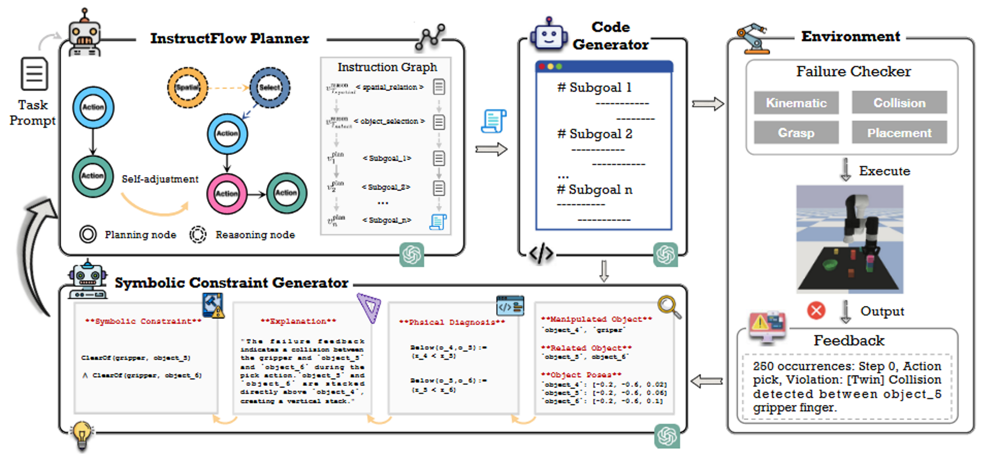

# instructflow
https://openreview.net/pdf?id=wr47LsSUjH

## 解决了什么问题：
基于语言模型的规划器难以进行长时程任务分解、自适应故障恢复和鲁棒的约束满足，因此论文的目标是提升LLM-driven代码生成在长时序、受约束操控任务重的成功率故障恢复能力

## 论文提出了：
 InstructFlow，一个模块化的多智能体框架，具有分层指令图和符号推理，用于结构化任务分解和可解释代码生成。两项核心创新：引入了分层指令图，将任务规划模块化为结构化的子目标，并支持基于诱导约束的动态反馈驱动更新；符号约束归纳机制将原始执行失败抽象为可解释的符号谓词，从而捕获关系层面和物理层面的任务失败原因。

## 为什么能解决:
将代码生成流程模块化成三个协作单元：规划器（解析任务并构建分层指令图）、代码生成器、约束生成器（监控执行失败并生成解释失败原因的符号约束）

1. 分层指令图：
根据任务目标、初始状态和符号反馈构建指令图G=（V,E），基于反馈的图更新 InstructFlow 的一项核心功能是能够根据符号约束反馈和故障诊断来修改指令图 G

2. 符号约束
把低层执行失败（例如碰撞、不能 reach）上升成符号谓词（例如 blocked_by(stack)、too_high(z>h_max)），这些符号既可解释又可被注入回 Planner/Code Generator 作为软约束，指导 LLM 在下次生成时避开根因而不是重复错误

## 独特性：
1.符号约束：是单纯靠 LLM 做失败说明或重新 prompt，而是归纳成可复用、可组合的符号谓词并把它们成为 planner 的显式条件，在长期任务和约束敏感场景中有用。
2.分层指令图+多agent
