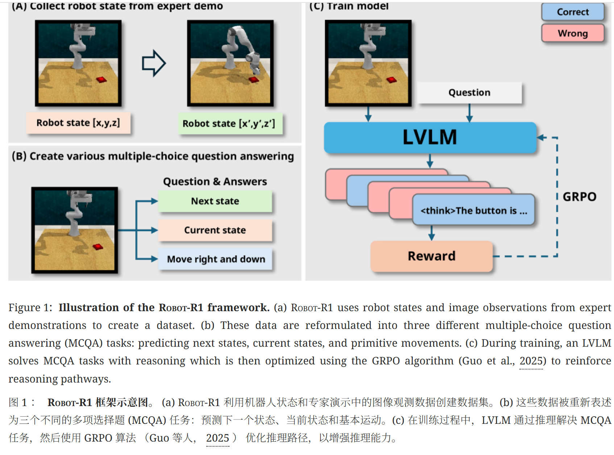

# RobotR1
https://ar5iv.labs.arxiv.org/html/2506.00070

## 解决了什么
尽管大型视觉-语言模型（LVLM）在理解指令和视觉内容方面表现出色，但当应用于机器人控制时，它们存在缺陷：
 * 缺乏具身推理： LVLM 传统上通过监督微调（SFT）进行训练，使其擅长识别物体和描述场景，但在预测下一步动作导致的精确物理变化（例如，物体在三维空间中的精确位置变化、力的作用结果）时表现不佳。
 * 低效的 SFT： 复杂的空间、几何和物理常识难以通过简单的 SFT 损失来学习。SFT 倾向于学习高频模式，而忽略了具身任务中至关重要的精确、低频的推理。

## 提出
设计了robotr1，通过训练低层逻辑模型（LVLM）通过推理过程预测完成任务所需的下一个关键点状态，并引入RL机制，专门优化 LVLM 内部的推理路径，以提高模型对下一个关键具身状态的预测准确性，从而提高机器人策略的成功率
并设计了robotr1bench的新型基准测试分析robotr1提升训练模型的具身推理能力

## 关键技术
1. 推理问题重构为 MCQA
为了让 LVLM 能够有效地进行 RL 训练，论文对问题进行了如下重构：
 * 简化状态空间： 不直接预测连续的低级关节动作，而是预测任务的下一个关键具身状态，特别是末端执行器（End-effector）的 3D 笛卡尔坐标 (x, y, z)。
 * 多项选择问答（MCQA）： 将预测问题转化为 MCQA 任务。在给定当前观测和指令的情况下，模型需要从一系列候选的下一步状态（$\text{Choice A}, \text{Choice B}, \dots$）中选择最正确的一个。
2. RL 驱动的推理路径优化
模型在推理时会生成一个推理序列（CoT），然后得出其预测下一个关键状态。RL的目标是优化这个推理序列。
 * 采样推理： 像处理 LLM 一样，模型通过采样生成多条不同的推理路径，从而得出多个下一个状态的预测。
 * 奖励模型： $\text{Robot-R1}$ 的核心。作用是评估模型生成的推理路径的质量，而不是最终动作的质量。奖励模型将 LVLM 的输出与真实世界数据进行比对，生成标量奖励 r_t。
 * RL 算法应用： 采用如 GRPO（一种策略梯度方法）等 RL 算法，以最大化累积奖励为目标来微调 LVLM 的参数。 RL 优化的不是最终的动作策略，而是 LVLM 内部生成具身推理序列的能力,使得模型学会如何思考才能在物理世界中得出正确的空间判断。