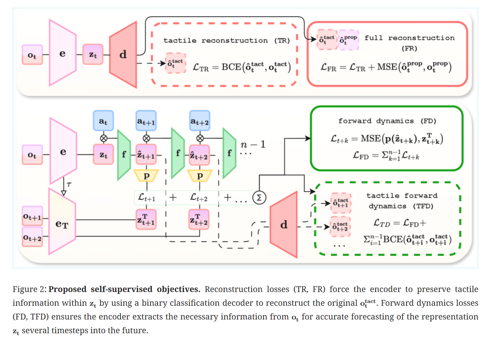

# Tactile-based RL
https://ar5iv.labs.arxiv.org/html/2510.21609

## 解决了什么问题：
触觉感知在强化学习的效用不稳定，触觉测量常具有稀疏性和非平滑性，导致深度RL代理难以提取有效信息，可能过早收敛

## 论文提出：
关键发现：稀疏二值触觉信号对于灵巧性至关重要，尤其是在机器人-物体解耦运动和低惯量物体交互等本体感受无法可靠捕捉的场景

因此，使用自监督学习SSL来辅助学习原始观察表征，将稀疏二值触觉信号转化为有效编码物体位置和速度的表示，提出4种用于触觉智能体的SSL目标：触觉重建、完全重建、前向动力学和触觉前向动力学，其中前向动力学最有效

证明将SSL训练数据与策略内记忆解耦可以提高性能

推出了机器人触觉ROTO基准测试

## 如何解决：
自监督损失使用辅助网络计算，提出四个不同的辅助学习目标用于训练
1. TR触觉重建 
2. FR
3. FD
4. TFD

重构损失（TR,FR）迫使编码器通过使用二元分类解码器重构原始的ottact，从而保留触觉信息，（FD,TFD）确保编码器提取到必要信息以准确预测未来时间步的表示
