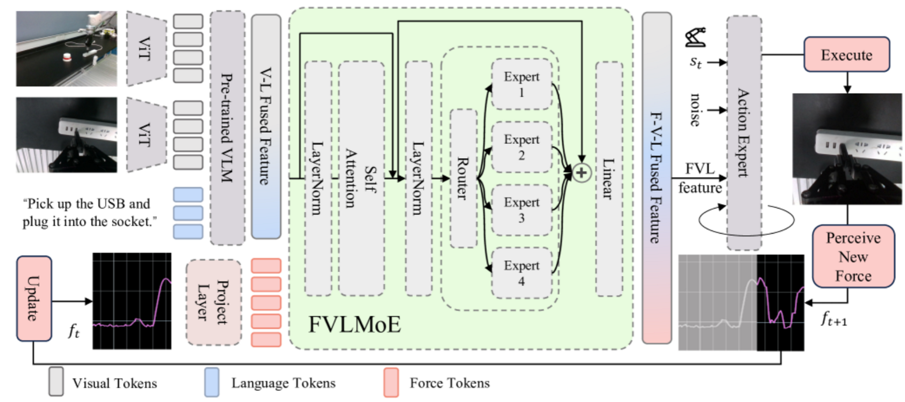

# ForceVLA
https://ar5iv.labs.arxiv.org/html/2505.22159

## 解决了什么问题：
现有的VLA模型主要依赖视觉+语言表示，在需要精细力控的接触密集型任务重表现不佳（如拔插压合擦拭），尤其是在视觉遮挡或动态不确定的情况下。

## 论文提出了：
将外部6轴力传感作为“一等模态”纳入VLA管线，并通过设计的FVLMoE模态将预训练的视觉语言嵌入与实时六轴力反馈相结合，在动作生成过程中动态处理并深度整合力、视觉和语言特征，从而显著增强 VLA 系统中的物理交互能力，使得机器人能够在特定模态的专家之间进行上下文感知路由，从而增强其适应细微接触动态的能力。

forceVLA概述:
基于 π0 框架 pi_0 ，集成了视觉、语言、本体感觉和六轴力反馈，并通过条件流匹配模型 rectifiedflow ; flowmatching 生成动作。来自多个 RGB 摄像头的视觉输入和任务指令由基于 SigLIP 的 siglip 视觉语言模型（基于 PaliGemma paligemma ）编码为上下文嵌入。

FVLMOE：
力读数被线性投影到专用标记中，并通过混合专家 (MoE) 模块与视觉语言嵌入融合

## 为什么能解决：
1. 力作为独立 token：力数据被线性投影为专门的 token 并在 VLM 之后注入 FVLMoE，使力信号不被视觉预训练特征“淹没”，而是作为高层交互信息参与路由决策
2. FVLMOE根据输入（视觉、语言、力）动态选择专家子网，不同专家专注不同模态阶段，从而更好确定力学需求（例如不同动作要求需要不同策略）

## 数据：
构建了Force-Data，接触丰富场景，同步采集RGB、位姿和六轴力矩数据
