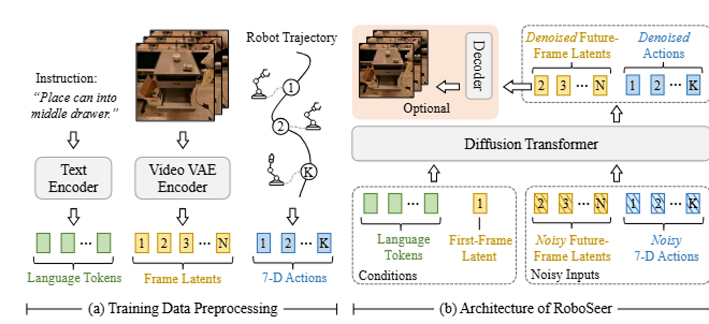

# VIDEOVLA

https://openreview.net/forum?id=UPHlqbZFZB

## 解决了什么问题：
现有VLA模型泛化能力有局限，缺乏对这个动作将导致何种未来结果的深入理解

## 论文提出了：
Video generation model具有转化为可泛化的机器人VLA操纵器的潜力
基本思想：通过联合建模V、L、A，模型能够同时预测动作序列和未来的视觉结果。

## 如何解决：
1. 统一多模态Diffsuion transformer统一编码：
2. 使用预训练的视频生成模型：
3. 双重预测与视觉想象：
在去噪过程中，模型被训练来预测动作序列A和未来视觉序列V

文本编码器将语言指令转换为固定长度的标记序列，而视频编码器将视频片段转换为潜在帧序列。采用扩散变换器架构，该架构以编码后的语言标记和第一潜在帧为条件，共同预测完成任务所需的下一个动作块，以及执行该动作块的预期视觉结果的未来潜在帧。