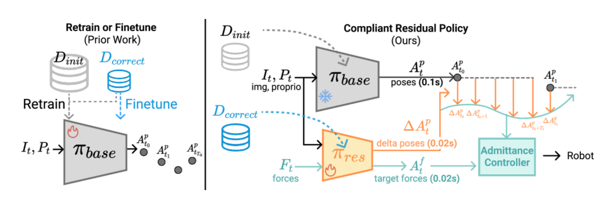

# CR-DAgger
https://ar5iv.labs.arxiv.org/html/2506.16685

## 什么是Dagger:
Dataset Aggregation 基于人类修正改善策略
如果机器人只模仿人类示范，最终在一些它没见过的错误状态中会失败，而Dagger强制机器人在它的状态分布上学习
执行-到达犯错状态-请专家标注正确动作-加进数据集重新训练

迭代过程：
1. 用人类演示数据训练初始policyπ₀
2. 让π₀自己跑任务，走到错误状态
3. 请人类专家给出正确动作a*,记录（state,a*）
4. 把新标注加入原来的训练数据
5. 重新训练策略π1

引入compliance：加入柔顺性，让机器人碰撞、接触、误差时不至于暴力硬推，而是顺着外力进行一定的位移或角度让步，从而避免装机产生大力、通过柔性缓冲继续完成任务

## 解决了什么问题：
Dagger在接触密集、长时序的操控任务重面临两个障碍：
1. 如何收集大量高质量人类修正数据 
2. 如何有效的利用新数据更新策略

## 论文提出了：
提出CR-Dagger，由compliant intervention interface干预接口（基于动觉教学的政策纠正系统用于收集行动增量信息，让用户感受到瞬时修正的幅度并进行微调）和compliant residual policy顺应残差策略（接受额外的力模态并预测残差运动和目标力）组成

通过引入柔顺性改进Dagger的数据收集和策略更新机制（compliant residual policy顺应性残差策略），从而在仅使用少量修正数据的情况下，显著提升机器人在高精度多接触任务的表现

## 怎么解决：
数据收集-柔顺干预界面：
采用delta修正，人类通过末端执行器的手柄对机器人施加力，提供增量动作。柔顺控制器确保干预平滑且不会中断策略。同时系统记录人类施加的力、扭矩作为额外的模态
策略更新-柔顺残差策略：
训练一个轻量的残差网络，叠加在预训练的基线策略上，将基线策略的图像编码器特征、以及高频力向量作为输入，输出一个15维的动作：SE3 增量位姿（相对于基线策略）和预期的外接触力
训练策略：将人类没有干预时的状态数据也标记为零残差动作纳入训练集，以帮助策略理解何时不需要修正。

## 数据：
真实机器人：通过书籍反转和传送带组装两个任务验证
On-policy interventions：人在 base policy 失败或接近失败时插手，做 delta corrections（顺应性手柄 + 力传感 + 记录按键）并记录 base command、delta 修正、力传感数据。
少量纠正集：论文演示用不到 50 次干预就显著提升成功率说明数据效率很高

