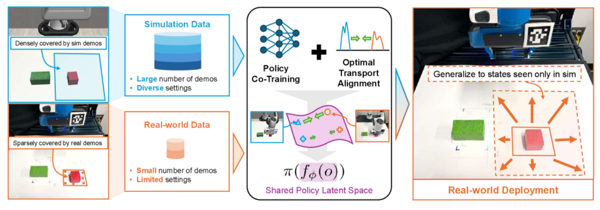
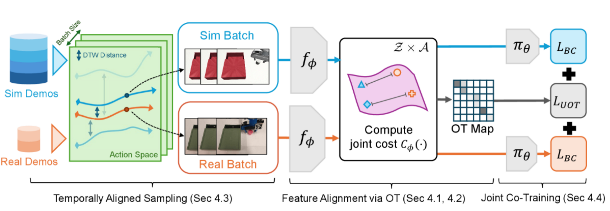

# Generalizable Domain Adaptation
https://ar5iv.labs.arxiv.org/html/2509.18631

## 解决了什么问题：
如何用大量自动生成的仿真示范 + 极少量真实示范联合训练行为克隆策略，使得策略在真实世界中具有更强的泛化能力——尤其是把仿真中丰富的数据有效迁移到现实，同时应对仿真与现实之间在视觉 / 观测上的域差异与数据不平衡问题。

## 论文提出了：
1. 新的训练方式：把真实数据和大量模拟数据一起训练，让网络学到一个不受domain差异干扰又能保留任务关键信息如目标位置、几何形状的latent space。
2. unbalanced OT非均衡最优传输，允许sim和real之间不严格OT不强制每个样本都找到 对齐点以避免灾难性错误

## 怎么解决：
1. co-traning：通过共享编码器、任务损失增强任务信息、不变性损失进行 domain alignment，以及用大量模拟数据形成基础、少量真实数据矫正偏差，最终构建出一个同时具备“任务可用性”和“跨域一致性”的 latent 表征空间。
2. UOT+时序采样：引入OT中的质量参数，只对齐对任务最重要的部分，按照时间顺序采样真实和模拟轨迹，确保UT只在比较相近的时间局部对齐，避免乱配对不同动作阶段

## 独特性：
1. 把OT嵌入到sim-to-real co-training的行为克隆流程中以对齐联合分布
2. 设计了专门处理仿真真实数据量级不平衡以规避灾难性错误的UOT设计+时序采样

## 数据：
仿真端：用自动化演示生成工具如MimecGen生成大量示范
真实端：人工手机的少量真实、稀疏但高质量数据
