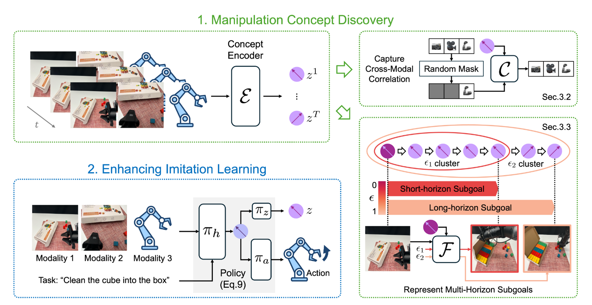

# Himacon
https://arxiv.org/pdf/2510.11321

## 解决了什么问题：
现有机器人操控策略在遇到环境变化时泛化能力差，论文要解决：如何从大量无标注、多模态演示数据中自动发现能够跨场景迁移的操作概念（把低层动作和高层目标连接起来），以增强策略在新环境下的适应性。

## 论文提出：
一种自监督框架（Himacon），通过跨模态相关学习与与多视界未来预测联合训练，从无标签的多模态数据中自动发现hierarchical manipulation concept层次化的操控概念，对多样化操作任务进行理解、泛化。

## 怎么解决：
1. Manipulaltion concept encoder概念编码器：把一个多模态时间序列输入变成每个时间步的连续概念向量（首先把每个时间步的图像特征编码把它们拼成多模态token序列，再用tf进行时间序列建模）

2. cross-modal correlation network(CMCN):掩码-预测车裂，随机屏蔽部分模态后用剩余模态与当前概念向量重构全部模态，从而让概念向量编码模态间一致保持的功能相关信息学习跨模态不变性
3. Multi-horizon future predictor(MHFP): 通过计算不同 coherence（相似性阈值）把概念序列聚成短/长子过程（sub-process），用概念embedding去预测子过程的terminal obsercation(终态，是实际观察图像而不是标签)，强制概念编码器学会每段动作意图、子任务的目标、整个任务的层级结构。
4. 联合目标训练：CMCN+MHFP+Policy共同约束概念编码器

## 独特性：
同时处理跨模态一致性和多时间尺度层级
无监督发现分层概念

## 扩展：
在海量多模态演示上训练类似Himacon的模型未后续少样本下游任务提供抽象先验