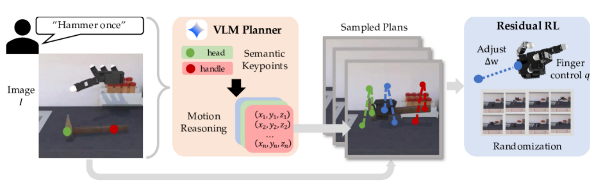
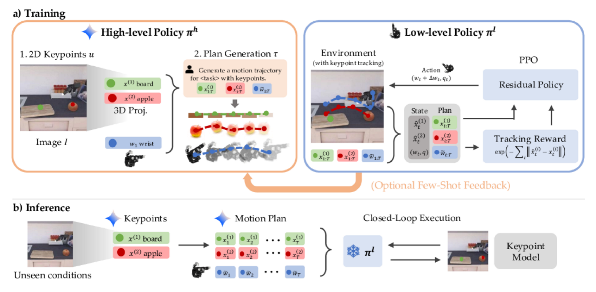

# Scaffolding
https://ar5iv.labs.arxiv.org/html/2506.19212

## 解决了什么问题：
Dexterous hands操控任务高质量演示数据匮乏，纯RL难以稳定学习且需要复杂的reward设计，因此将dexterous manipulation重新定义为轨迹跟踪问题，要解决如何利用VLM提供可执行的轨迹，把复杂控制问题拆解成可由底层RL学习跟踪的MDP，实现simtoreal zero-shot的可行性

## 论文提出：
VLM根据语言指令和场景图像生成手部和物体的关键点轨迹，从而定义在仿真环境里训练的低级残差强化学习的监督目标，通过控制灵巧手，低级策略学习有效的跟踪轨迹并完成任务

## 怎么解决：
1. VLM识别图中关键任务点并输出3D轨迹 语义关键点检测（用深度信息将二维关键点转换到三维世界坐标系）-粗略轨迹生成（粗略：低级强化学习可以弥补位置上的误差）-插值
Few-shot improvement：将底层策略成功执行的计划示例用作后续生成呃上下文示例，通过迭代修正VLM的错误

2. 残差强化学习：低层策略不直接学习从图像到动作的全部映射，而是学习预测对VLM计划的残差，奖励函数如下：

## 独特性：
VLM直接用于生成3D关键点而不是高层目标，以此作为scaffold引导底层学习
简化奖励函数，以跟踪关键点轨迹为reward简化低层训练目标，使得RL更高效
闭环：把成功执行的trajectory作为示例回喂给VLM提示

## 数据：
一组 dexterous manipulation tasks（hammering、scissors、semantic pick-place、open/close 等），用于评估 VLM→low-level pipeline 在多任务上的成功率。在仿真中用若干随机化与多种初始条件进行测试，并对比 oracle（perfect scripted plan）与纯 RL baselines。
在真实机器人上演示以展示 sim→real 潜力。

