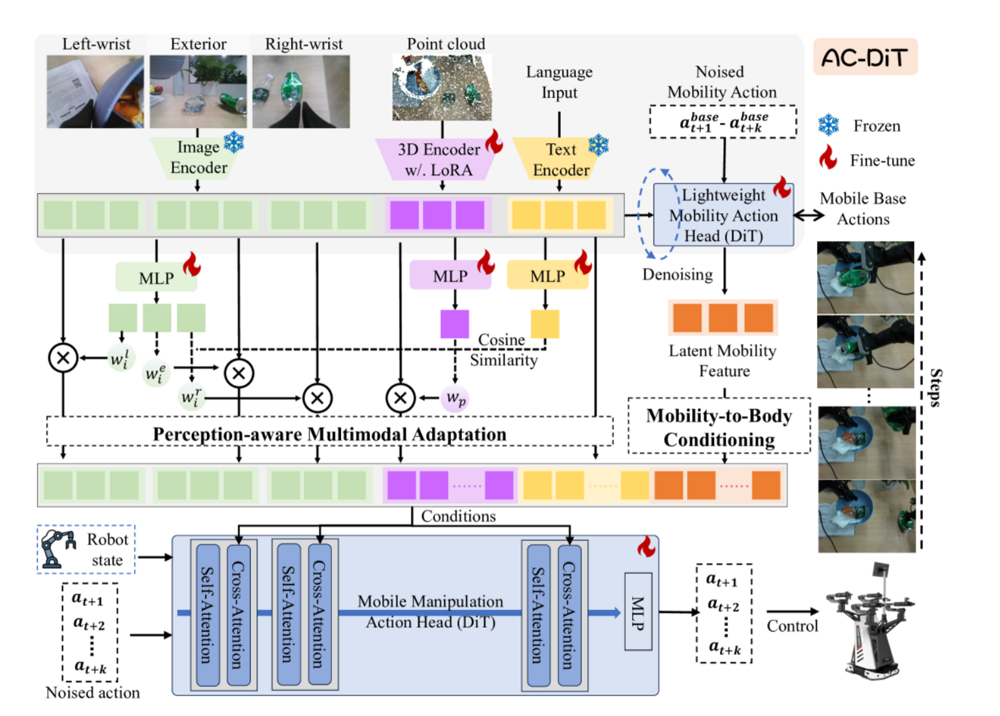

# AC-Dit
https://arxiv.org/pdf/2507.01961

## 解决了什么问题：
Mobile manipulation要同时控制移动底盘和机械臂，两者高度耦合，底盘的小幅位移会放大到臂端，导致操控误差积累。而现有端到端方法往往没有显式建模底盘对机械臂的影响，另一类方法又在感知模态上只用2D/3D，因此，如何提出一个端到端的移动操作框架，有效利用底盘和机械臂之间的关系以及不同任务阶段的特征实现精确协调。

## 论文提出：
一个面向mobile manipulation的端到端Diffusion Transformer框架，通过mobility-to-body conditioning把底盘的运动作为条件先验 和 perception-aware multimodal adaptation根据阶段自适应调整2D/3D感知融合权重 改善底盘与机械臂的协调，并在仿真与真实场景中提高移动操控的成功率和鲁棒性

## 怎么解决：
1. mobility-to-body conditioning 
先训练一个轻量的mobility action head，仅预测底盘动作，以学习底盘运动的latent mobilty features，并把该latent作为条件输入给完整的action head，让网络在预测整套动作是考虑底盘对臂端动作的影响，避免误差积累
2. perception-aware multimodal adaptation
将提取的语言特征、来自多视角的图像特征和点云特征投影到共享的特征空间，再通过计算每种视觉模态与语言特征的余弦相似度评估重要性，并据此动态调整2D/3D token的融合权重，并弱化无用视角
3. 总体结构
由image encoder、3D encoder、text enconder组成，分别从三个相机视角的2D图像、3D点云和语言输入中提取特征，用SigLIP作为三个编码器的backbone，将1和2输入到两个action heads，最终输出整段动作

## 独特性：
1. 不同于以往把底盘和臂一起拼到同一向量去预测，把底盘作为先验条件输入预测
2. 动态的2D/3D感知权重

## 数据：
ManiSkill-HAB移动操控仿真集上评估，涵盖语言条件的家居任务对比多种baseline
