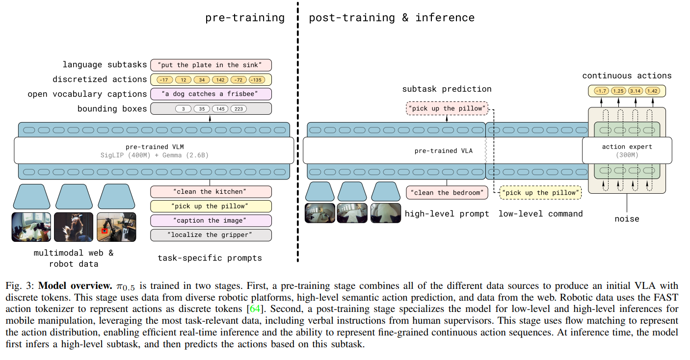

# pi0.5
## 解决的问题
解决pi0在面对全新环境、未见过的物体组合时，1缺乏高层规划2泛化能力仍有局限的问题。
## 解决方案
引入了引入异构任务上的协同训练（Co-training on Heterogeneous Tasks）和语义预测，以提高模型的抽象和规划能力。
## 技术特点
1. 分层语义协同训练 (Hierarchical Co-training)：
仍然是transform结构，继承pi0的VLM Backbone。
   * 纯粹的 VLA 倾向于将所有任务都视为低级动作序列，导致模型对任务目标和子任务边界的理解模糊。
   * 被训练产生两种不同输出：低级动作序列 $\mathbf{x}^* $和高级语义预测$ s_{next} $
   * VLM负责高层规划和意图解释，流匹配专家负责低层快速执行
使用了co-training loss 
2. 数据多样性：
通过训练数据中环境数量的扩展pi0.5的泛化性能随着训练环境多样性的增加而稳定提高。
   * High-Environment-Variance Training 使VLM忽略与任务无关的噪声
   * 利用VLM的zero-shot能力

   