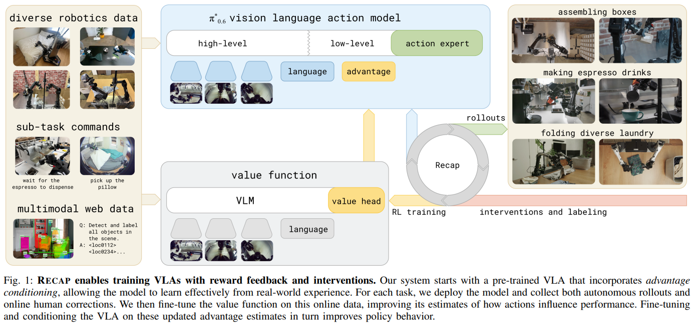

# pi0.6
## 解决的问题
1. 纯IL在遇到训练数据中没有的错误、扰动或异常状态时，容易陷入无法恢复的困境，且不能自主探索更好策略
2. 计算效率低下：Flow/Diffusion策略在每个控制步骤都使用固定的最大计算预算，浪费资源且响应延迟高。
## 解决方案
1. Recap训练方法，使VLA能够在训练流程的所有阶段融入奖励反馈
   * 阶段一：离线RL预训练。目的： 学习一个鲁棒的价值函数（Value Function V($\mathbf{s}$) 或 Q($\mathbf{s}, \mathbf{a}$)），在大规模、异构的机器人轨迹数据集上，使用 Offline RL 算法（如 IQL, CQL 等变体）进行预训练，旨在从静态数据中学习一个保守且准确的价值估计。这个价值函数能够对任意状态（包括失败或异常状态）下的成功潜力进行评分，这为后续的自主实践提供了内在奖励信号和数据过滤标准。
   * 阶段二：自主实践。目的： 让机器人主动探索策略空间，发现纯模仿学习无法覆盖的边缘案例，然后用预训练的Q函数进行评分
   * 阶段三：自我改进与人工修正。利用阶段一训练的价值函数对阶段二实践生成的新轨迹进行评分和过滤，只保留那些高价值、高成功率的轨迹，并将它们添加到训练数据集中。只有当机器人犯下严重错误时，人类操作员才会介入，演示如何从该特定错误中恢复。
2. 难度感知自适应计算 (Difficulty-Aware Adaptive Compute)
通过动态调整其Flow Matching动作专家的计算预算，解决固定计算资源带来的效率和延迟问题。
   * 难度分类器 (Difficulty Classifier)实时判断当前机器人所处状态的任务难度d_t：首先，对部分轨迹数据进行人工难度标注（例如，Easy/Medium/Hard）。训练一个轻量级 CNN 或微调 VLM 来处理 RGB-D 观测 $\mathbf{o}_t$，并预测难度等级 d_t。
   * 动态调整 Flow Matching 推理配置:难度等级 d_t 被映射到一个最优的推理配置三元组 M(d_t) = $\langle N_t, \text{Solver}_t, \text{Type}\rangle$:
       * N_t（积分步数）：Easy $\to$ 少量步数（如 5）；Hard $\to$ 较多步数（如 20）。
       * $\text{Solver}_t$（求解器）：Easy $\to$ 快速但不精确的 Euler；Hard $\to$ 慢速但高精确度的 RK4/Heun。
       * $\text{Type}_t$（积分类型）：Easy $\to$ ODE（确定性，追求速度）；Hard $\to$ SDE（引入噪声，追求鲁棒性/探索）。

