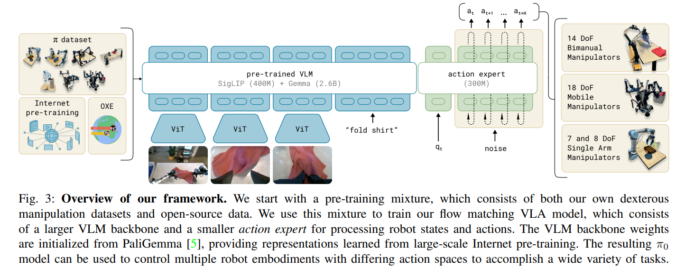

# pi0
## 解决的问题
传统的机器人学习方法（如RL或IL）要么需要大量的特定任务数据，要么缺乏通用常识和泛化能力。pi0要解决传统机器人控制策略缺乏通用性、泛化能力弱的问题，创建一个单一的、跨任务、跨平台的通用机器人大脑。
## 解决方案
将视觉、语言和低级动作集成到一个统一的框架中，使机器人能够：
1. 理解自然语言指令（语言能力）。
2. 感知复杂环境（视觉能力）。
3. 生成平滑、精确的机器人动作（低级控制能力）。
将大规模预训练的VLM与连续动作生成机制结合，构建VLA。
## 技术特点
1. LLM backbone:
采用了经过海量互联网数据预训练的 VLM 作为骨干。
   * VLM负责处理输入的RGB-D图像和自然语言指令。它将这些多模态输入编码成一个高维、语义丰富的特征向量。
   * 这个特征向量包含物体识别、空间关系、任务语义等通用知识，极大减少了机器人从零开始学习常识的负担。
2. Flow Matching：
   * VLM的输出通常是高层语义，直接映射到关节控制动作会导致不平滑、不准确
   * 训练一个基于流匹配的动作专家，条件生成模型$\mu(\mathbf{x}, t | \mathbf{o}, \mathbf{l})$，它学习一个速度场 $\mathbf{v}$，该速度场描述了如何将初始噪声 $\mathbf{\epsilon} $逐步、确定性地推向最终的专家动作序列 $\mathbf{x}^*$。在推理时，通过 ODE 求解器对速度场进行积分，只需几步迭代就能生成平滑、高频的目标动作序列。

